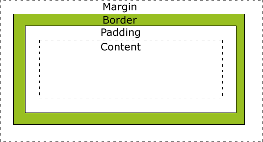

# CSS 盒子模型(Box Model)
所有HTML元素可以看作盒子，在CSS中，"box model"这一术语是用来设计和布局时使用。

CSS盒模型本质上是一个盒子，封装周围的HTML元素，它包括：边距，边框，填充，和实际内容。

盒模型允许我们在其它元素和周围元素边框之间的空间放置元素。

下面的图片说明了盒子模型(Box Model)：

CSS box-model
不同部分的说明：

* Margin(外边距) - 清除边框外的区域，外边距是透明的。
* Border(边框) - 围绕在内边距和内容外的边框。
* Padding(内边距) - 清除内容周围的区域，内边距是透明的。
* Content(内容) - 盒子的内容，显示文本和图像。

为了正确设置元素在所有浏览器中的宽度和高度，你需要知道的盒模型是如何工作的。
1. box-sizing
 
   * box-sizing:content-box;其宽度width只包含内容宽度。
   * box-sizing:border-box;其宽度width包含content、padding、border总宽度。

   （个人喜欢用border-box）
2. margin
   
    子级之间margin的合并：

    * 子级元素间，margin会自动合并；
    * 使用display：line-block可取消合并；
  
    父、子级间margin的合并：

    * 只对上下合并，不对左右合并；
    * 取消合并方法(三个):
     padding/border;
     overflow:hidden;
     display:flex;

## 浏览器的兼容性问题

一旦为页面设置了恰当的 DTD，大多数浏览器都会按照上面的图示来呈现内容。然而 IE 5 和 6 的呈现却是不正确的。根据 W3C 的规范，元素内容占据的空间是由 width 属性设置的，而内容周围的 padding 和 border 值是另外计算的。不幸的是，IE5.X 和 6 在怪异模式中使用自己的非标准模型。这些浏览器的 width 属性不是内容的宽度，而是内容、内边距和边框的宽度的总和。

虽然有方法解决这个问题。但是目前最好的解决方案是回避这个问题。也就是，不要给元素添加具有指定宽度的内边距，而是尝试将内边距或外边距添加到元素的父元素和子元素。

IE8 及更早IE版本不支持设置填充的宽度和边框的宽度属性。

解决IE8及更早版本不兼容问题可以在HTML页面声明!DOCTYPE html即可。

   